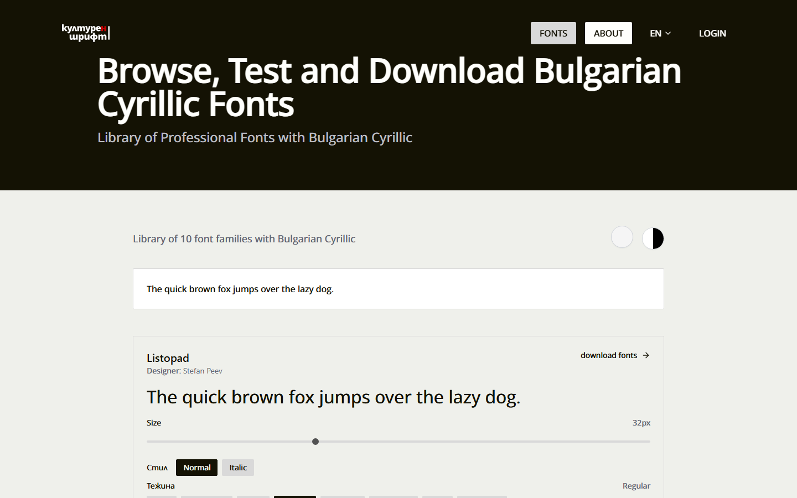
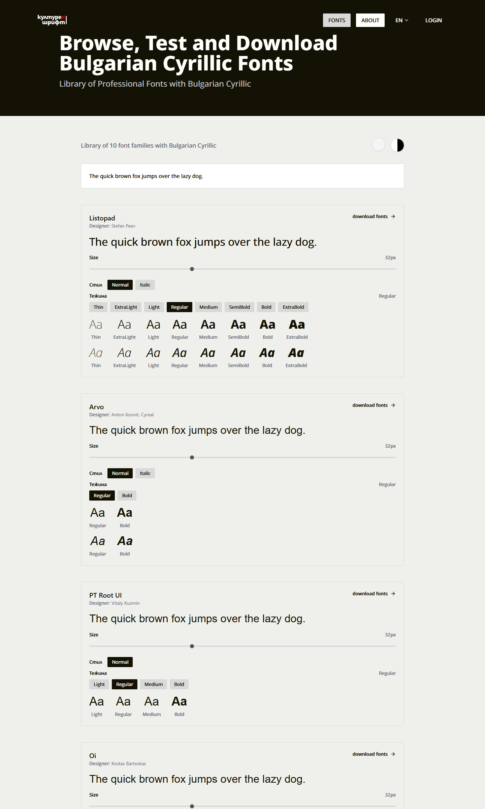
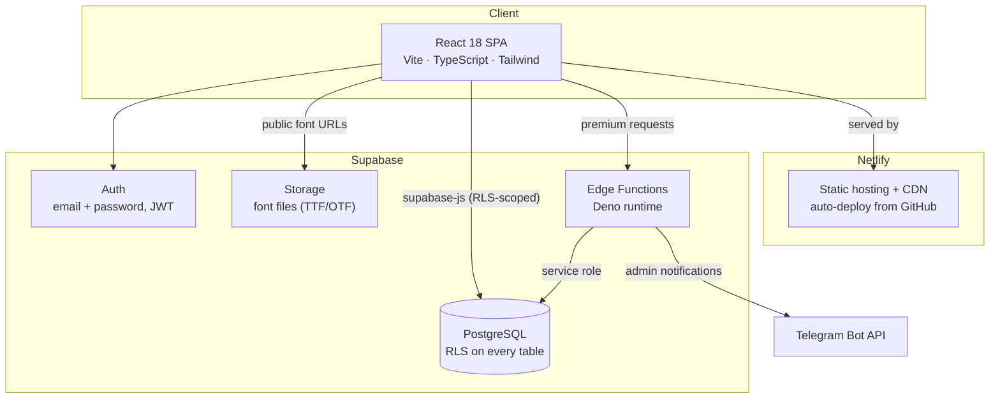
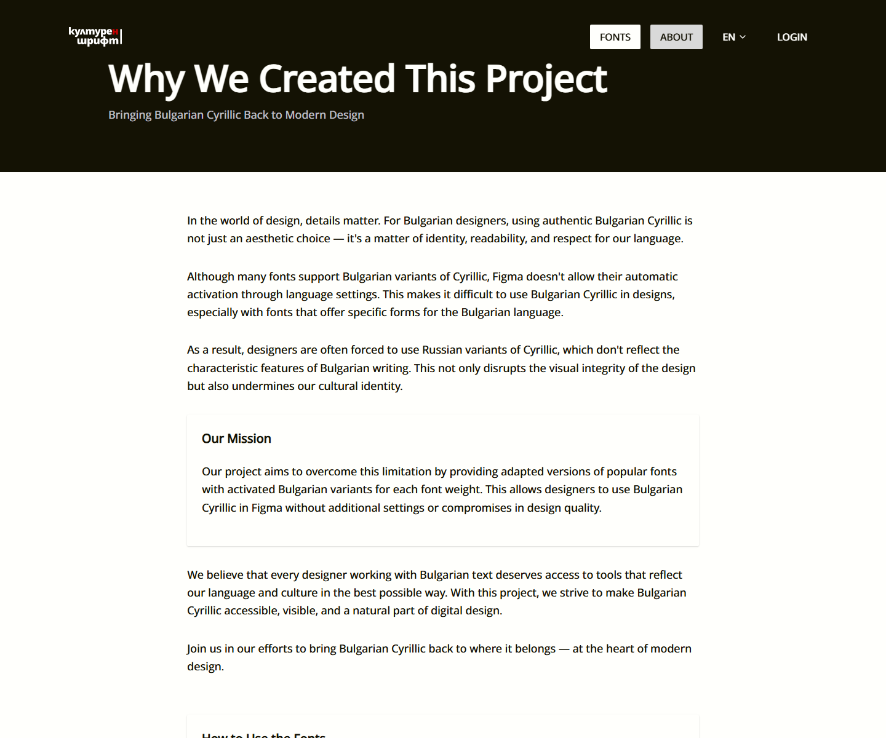

<div align="center">

# Културен Шрифт — Bulgarian Cyrillic Font Library

**Browse, test and download professional fonts with authentic Bulgarian Cyrillic — built for designers working in Figma.**

[](https://schrift.culturen.design)
[](https://yordan-portfolio.vercel.app/)




</div>

---

## Why This Exists

In Bulgarian typography, details are identity. Bulgarian Cyrillic has its own letterforms — visibly different from the Russian Cyrillic shapes that most software defaults to. Many fonts *do* ship Bulgarian variants (as OpenType `locl` features), but **Figma provides no way to activate them through language settings**.

The result: Bulgarian designers are quietly forced to typeset their own language with Russian letterforms — breaking both the visual integrity of their work and a piece of cultural identity.

**Културен Шрифт** ("Cultural Font") solves this at the font level. Every family in the library is an adapted build with the Bulgarian variants activated *per weight*, so they render correctly in Figma with zero configuration. Designers browse, preview with their own text, and download ready-to-use font packages.

## Features

### For designers
- **Interactive type tester** — every family on the home page renders live: type your own text, drag the size slider, switch weights (Thin → ExtraBold) and toggle italics, all rendered with the actual font files
- **One-click downloads** — font families are packaged client-side into ZIP archives (JSZip) with all selected weights
- **Free + premium tiers** — free fonts for everyone; the full library unlocks by following [@Culturenstudio](https://x.com/Culturenstudio) during the open alpha (no payment, no card)
- **Bilingual UI** — full Bulgarian / English internationalization with automatic language detection (i18next)

### For the platform
- **Complete admin CMS** — font manager with file uploads and per-weight metadata, user management, premium access management, and site settings — all built in-app, no external CMS
- **Premium request pipeline** — users submit a request from the site → recorded in Postgres → **real-time Telegram notification** to the admin via bot → one-click approval in the admin panel
- **SEO engineered in** — per-route meta tags and canonical URLs (react-helmet-async), JSON-LD structured data, and a **dynamic sitemap generated at the edge** that stays current as fonts are added

<div align="center">

</div>

## Architecture

A serverless architecture: a static React SPA on Netlify's CDN talks directly to Supabase, with row-level security in Postgres as the single source of authorization truth.



### Edge functions

| Function | Purpose |
|---|---|
| `request-premium` | Validates the authenticated user, records a premium access request, notifies the admin on Telegram |
| `generate-sitemap` | Builds an up-to-date XML sitemap from the live font catalog, served with edge caching |
| `delete-user` | Full account deletion: cascading cleanup across favorites, subscriptions and analytics, then auth |
| `admin-delete-user` | Admin-side account removal with the same cascading guarantees |
| `stripe-*` | Complete Stripe subscription infrastructure (checkout, webhooks with signature verification, customer portal) — built and tested, currently dormant while the alpha is free |

### Security model

Authorization lives in the database, not the client:

- **Row-level security on every table** — 19 policies govern who reads and writes what; the browser only ever holds the public anon key
- **Role-based admin** — a `user_role` enum on profiles, checked through `SECURITY DEFINER` helper functions (`is_admin()`), gates every admin policy and RPC
- **Premium gating as a DB function** — `has_active_premium()` is the single source of truth, called via RPC from the client and enforced by policies server-side
- **Grants are auditable** — premium access records who granted it (`granted_by`) and when it expires; extending an active subscription stacks from its current expiry

### Engineering details worth a look

- **Dynamic font loading** — font files live in Supabase Storage; the client builds `@font-face` rules at runtime from each family's weight map (`weight_files` JSONB), so adding a font in the admin panel requires zero code changes
- **Client-side ZIP packaging** — downloads fetch the selected weights and assemble the archive in the browser, keeping the server stateless
- **The type tester *is* the catalog** — no static specimen images anywhere; every preview is real text in the real font, which doubles as proof that the Bulgarian forms actually work
- **Design token system** — a small custom design system (`tokens.css` → `themes.css` → `design-system.css`) with semantic color/spacing/typography variables layered under Tailwind

## Design

The interface stays out of the typography's way: a near-black (`#141204`) hero, warm off-white (`#FFFFFC`) surfaces, and a single red accent (`#C40000`) — a nod to the Bulgarian flag. The display face is **Listopad**, one of the library's own Bulgarian Cyrillic fonts, so the site is typeset in the very product it serves.

<div align="center">

</div>

## Data Model

Core tables (all RLS-protected):

- **`fonts`** — rich per-family metadata: designer, foundry, license, weights, OpenType features, character set, sample text, and the JSONB weight→file map that powers the type tester
- **`users`** — profiles with `user`/`admin` roles, auto-created by trigger on signup
- **`user_subscriptions`** — premium access with expiry and grant audit trail
- **`premium_requests`** — the follow-to-unlock alpha queue (one pending request per user, enforced by a partial unique index)
- **`stripe_*`** — customer/subscription/order mirrors for the dormant payments path

## Running Locally

```bash
git clone https://github.com/yordanhristovUX/schrift.digital.git
cd schrift.digital
npm install

# .env
# VITE_SUPABASE_URL=https://<your-project>.supabase.co
# VITE_SUPABASE_ANON_KEY=<your-anon-key>

npm run dev
```

The database schema lives in [`supabase/migrations`](supabase/migrations) and edge functions in [`supabase/functions`](supabase/functions) — a fresh Supabase project can be brought up with the Supabase CLI (`supabase db push`, `supabase functions deploy`).

## Credits & License

The fonts in the library are the work of their respective designers — including Stefan Peev (Listopad), Anton Koovit & Cyreal (Arvo), Vitaly Kuzmin (PT Root UI), Kostas Bartsokas (Oi) and others — adapted with activated Bulgarian Cyrillic variants. Each family's designer, foundry and license are credited on its detail page; fonts remain under their original licenses.

Platform code © Yordan Hristov, all rights reserved.

---

<div align="center">

Built by **[Yordan Hristov](https://yordan-portfolio.vercel.app/)** · [Culturen Studio](https://x.com/Culturenstudio)

*Bringing Bulgarian Cyrillic back to where it belongs — the heart of modern design.*

</div>
